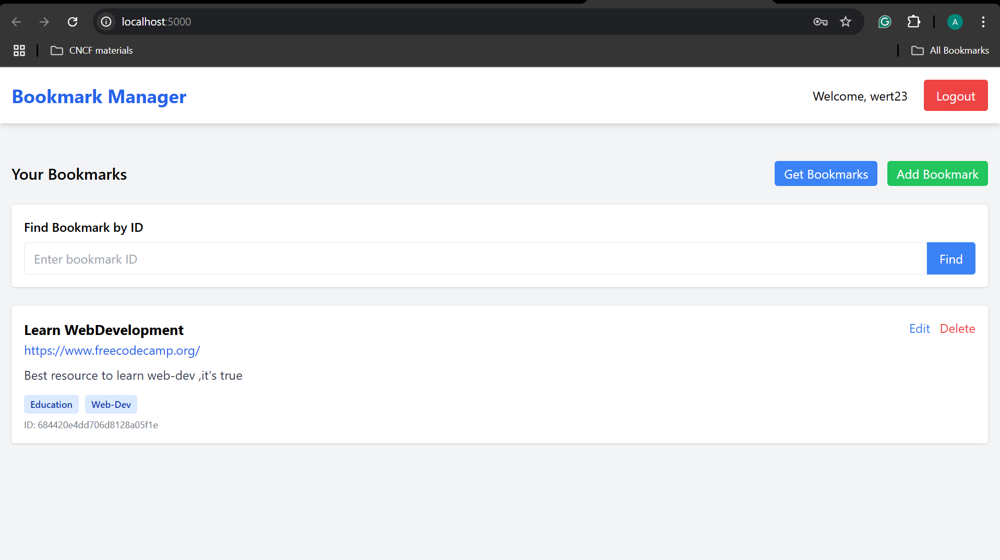

# Bookmark Manager

A full-stack web application for managing and organizing your bookmarks. Built with Node.js, Express, MongoDB, and vanilla JavaScript.

## 📋 Features

### User Authentication
- User signup and login with JWT authentication
- Secure password hashing with bcrypt

### Bookmark Management
- Create, read, update, and delete bookmarks
- Store title, URL, description, and tags for each bookmark
- Search for bookmarks by ID
- User-specific bookmark collections

### Responsive UI
- Clean, modern interface built with TailwindCSS
- Mobile-friendly design

## 🛠️ Technology Stack

### Backend:
- Node.js
- Express.js
- MongoDB/Mongoose
- JWT for authentication
- bcrypt for password hashing

### Frontend:
- HTML
- CSS (TailwindCSS)
- JavaScript (Vanilla)

## 🚀 Future Improvements
1. Implement bookmark categorization
2. Add tag-based filtering
3. Implement bookmark sharing functionality
4. Add pagination for large bookmark collections
5. Develop browser extension for easy bookmarking

## 📁 Project Structure
```
bookmark_project/
├── backend/
│   ├── models/
│   │   ├── Bookmark.js
│   │   └── user.js
│   ├── routes/
│   │   └── bookmarkRoutes.js
│   ├── server.js
│   ├── package.json
│   └── .env
├── frontend/
│   └── public/
│       ├── index.html
│       └── app.js
├── images/
│   ├── p1.png
│   └── p2.png
└── README.md
```

## 🔧 Installation & Setup

1. **Clone the repository**
   ```bash
   git clone <repository-url>
   cd bookmark_project
   ```

2. **Install dependencies**
   ```bash
   cd backend
   npm install
   ```

3. **Set up environment variables**
   Create a `.env` file in the backend directory:
   ```env
   MONGODB_URI=mongodb://localhost:27017/bookmark_manager
   JWT_SECRET=your_jwt_secret_key
   PORT=5000
   ```

4. **Start the server**
   ```bash
   npm start
   ```

5. **Access the application**
   Open your browser and navigate to `http://localhost:5000`

## 🚀 API Endpoints

### Authentication
- `POST /api/bookmarks/users/signup` - User registration
- `POST /api/bookmarks/users/login` - User login

### Bookmarks
- `GET /api/bookmarks` - Get user's bookmarks
- `POST /api/bookmarks` - Create new bookmark
- `PUT /api/bookmarks/:id` - Update bookmark
- `DELETE /api/bookmarks/:id` - Delete bookmark
- `GET /api/bookmarks/:id` - Get specific bookmark

## 📸 Screenshots




